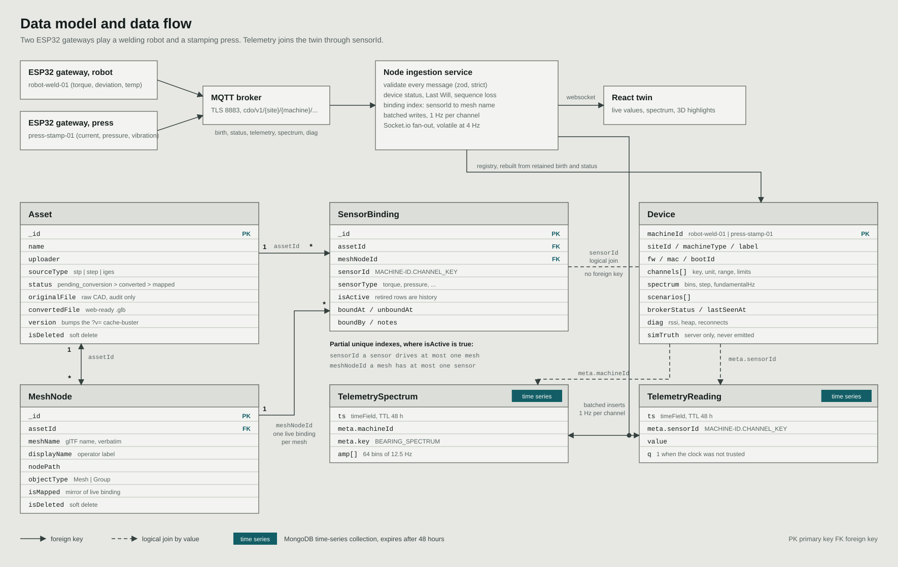

# Cognitive DataOps

**Agentic Contextualization of Edge Telemetry for Digital Twins**

A web-native digital twin for a car plant. You upload a 3D model of the plant, connect machines to it, bind their live telemetry channels to parts of the model, and watch a welding robot and a stamping press stream into the twin in real time. Two ESP32 boards play those machines and publish over MQTT.

On top of that sits an **agentic layer in Python**. When a channel crosses a limit or drifts from its learned baseline, a diagnosis agent reads the machine, scores the fault signatures defined in the machine manuals, retrieves the supporting pages, publishes a cited report and lights the failing part on the 3D model. An assistant answers questions about one twin (and the part you selected) or about the whole plant. It shows every step it takes and every page it reads, and can fly the camera to the part it talks about.

> **Capstone project**, B.Tech CSE, VIT Chennai
> Kevin Bose J (23BCE5105), Joseph Shalom A (23BCE1078), Shubham Chattopadhyay (23BCE1671)

---

## Contents

1. [What it does](#what-it-does)
2. [Current status](#current-status)
3. [How the pieces fit](#how-the-pieces-fit)
4. [The client journey, step by step](#the-client-journey-step-by-step)
5. [Quick start](#quick-start) (what runs where, the three terminals)
6. [The diagnosis agent and the assistant](#the-diagnosis-agent-and-the-assistant)
7. [The ESP32 gateways](#the-esp32-gateways)
8. [What is general and what is specific to the two machines](#what-is-general-and-what-is-specific-to-the-two-machines)
9. [Repository layout](#repository-layout)
10. [Data model](#data-model), [API reference](#api-reference), [Worked example](#worked-example)
11. [Design decisions worth knowing](#design-decisions-worth-knowing)
12. [Safety rails](#safety-rails)
13. [Verification](#verification), [Environment reference](#environment-reference), [Troubleshooting](#troubleshooting)
14. [Documentation index](#documentation-index)

---

## What it does

| Area | What you get |
|---|---|
| **Asset pipeline** | Upload raw CAD (stored for provenance, never rendered) and a Blender-exported `.glb`. A status ratchet (awaiting mesh, renderable, instrumented) tracks each asset. |
| **Spatial mapping** | Click any part in the 3D viewer, or pick it from a filterable list of every named mesh (about 800 to 1,200 per model), and bind a sensor to it. One sensor drives one mesh and one mesh has one sensor, enforced by the database. Retired bindings stay as history. |
| **Machines** | A gateway announces itself and appears as *available*. Adding it to a twin is a deliberate step; removing it retires the bindings of its channels. A machine belongs to one twin at a time. |
| **Live telemetry** | Values at 2 Hz with trend lines and normal, warning and alarm states derived from limits the machine declares. A 64-bin vibration spectrum for the press, with its shaft harmonics marked. |
| **3D feedback** | A bound mesh flashes green when bound, tints amber on a warning and pulses red on an alarm. Picking a part in the component list glides the camera to frame it; picking a part on the model scrolls the list to it. The inspector slides in only when a part is picked. |
| **Fault injection** | Scenario buttons (clogged lube filter, bearing wear, gearbox wear) command the machine over MQTT with no cable, with the acknowledgement round trip shown. |
| **Anomaly detection** | Deterministic rules on every sample: a 10 s mean past a limit, or a 60 s mean drifting six deviations from the channel's learned baseline while still inside its limits (the bearing-wear case alarms miss). One investigation per machine, escalation, cooldown, resolution. |
| **Diagnosis agent** | A Python LangGraph service. It computes the features the diagnostic procedures define (P60, V60, HB300, PMR300, defect lines, dI/dV for the press; cycle mean, sixth-harmonic ripple, consistency ratios for the robot), scores the documented fault signatures, cites the manuals and posts a report: root cause with confidence, alternatives, every test with its verdict, actions, sources, and the parts to look at. |
| **Assistant** | A chat panel scoped to a twin (and its selected part) or to the whole plant. Gemini 3.5 Flash Lite with tools when a key is set, a rule-based answerer when not. Each answer streams its steps (a collapsible progress tracker showing what was read), then the text with linked sources. It can highlight parts and move the camera. |
| **Knowledge base** | Five documents per machine (operating conditions, failure modes, diagnostic procedures, maintenance, case history), chunked and indexed in `RAG/` with hybrid dense and keyword retrieval. |
| **Edge firmware** | One Arduino sketch for both boards. Connection state machine, TLS or plain MQTT, Last Will, remote logging, command handling, watchdog, and a self-test that proves the C++ models equal the JavaScript ones. |
| **Software simulator** | Impersonates both boards with the same wire contract, for development without hardware and as demo insurance. |
| **3D plant model** | `car_factory_updated.glb`: a true-scale car plant generated in Blender, with every bindable part named and labelled (`PRESS_LUBE_FILTER`, "Lube oil filter bank (duplex)"). |
| **Tooling** | `fw.mjs` for ports, compile, upload, monitor and self-test with safety checks; a catalog generator; a demo seed; UI and contrast audits; `scripts/agent.mjs` to set up, run and test the agent. |
| **Documentation** | Wire contract, agent design as built, factory floor plan, runbooks, demo script, thesis narrative, data-model diagram. |

---

## Current status

| Phase | Scope | State |
|---|---|---|
| 1. Asset pipeline | CAD and GLB ingestion, provenance, conversion state machine | Done |
| 2. Spatial mapping | Mesh-node registry, sensor bindings, twin-scene API, R3F viewer with click to bind | Done |
| 3. Edge telemetry | MQTT contract, ingestion service, MongoDB time series, Socket.io, simulator, ESP32 firmware | Done. **Both boards are flashed and publishing to a local Mosquitto broker**, checked on the wire (birth, status, 2 Hz telemetry, spectrum, diagnostics, no reconnects). |
| 4. Live twin | Machines tab, live values and spectrum, channel-aware binding form, bind flash, alarm tints, fault injection | Done |
| 5. Agentic layer | Anomaly detector, MCP tool server, Python LangGraph agent (diagnosis and chat) over the RAG module, cited reports, scoped assistant with a live step tracker, the agent pointing at parts | Done, checked live with Gemini: [`docs/phase5-agent-blueprint.md`](docs/phase5-agent-blueprint.md) |
| Plant model | True-scale car factory generated in Blender, named and labelled parts | Done: [`docs/factory-floor-plan.md`](docs/factory-floor-plan.md) |
| UI | A full redesign ("UI v3") of every screen, plus terms and privacy pages | Done: [`DESIGN.md`](DESIGN.md) |

Still to do by hand: a rehearsal of [`docs/demo-script.md`](docs/demo-script.md) on the real boards with the agent running, the on-chip self-test (`node scripts/fw.mjs selftest`), and filling in the institution name and contact on the legal pages.

---

## How the pieces fit

```
ESP32 gateway (robot)  \                                          +--> React twin (R3F, Redux)  :5173
                        >--> MQTT broker --> Node API  :5000 -----+      machines, live values, spectrum,
ESP32 gateway (press)  /   (Mosquitto or     validate, store,            binding, 3D highlights,
                            HiveMQ Cloud)    broadcast, detector         reports, assistant
                                               |        ^  |
                                   MongoDB  <--+   MCP  |  | investigations, chat (SSE)
                         assets, bindings,              |  v
                         devices, telemetry,        Python agent  :8100
                         investigations, reports    LangGraph lanes, fault scoring,
                                                    RAG/ manuals, Gemini (optional)
```

The browser talks only to the Node API. The agent never sees the browser: it reads the plant through Node's MCP endpoint with a shared service key, and Node relays the chat stream and pushes reports and "point at this part" commands over Socket.io.

Plants rarely bolt sensors onto a machine. A welding robot or a stamping press already computes its own torque, path deviation, motor current and lubrication pressure, and a gateway publishes that state onto an MQTT backbone organised as a Unified Namespace (`cdo/v1/{site}/{machine}/{topic}`). The two ESP32 boards play that gateway role, each simulating one machine's controller. The browser never talks to the broker: every sample goes through the Node service, which validates it and resolves which mesh it drives.

Details: [`docs/mqtt-contract.md`](docs/mqtt-contract.md) (the wire format), [`firmware/README.md`](firmware/README.md) (the boards), [`docs/phase5-agent-blueprint.md`](docs/phase5-agent-blueprint.md) (the agent).

---

## The client journey, step by step

This is the path a new client follows from a fresh model to a live, bound twin.

1. **Create the twin.** Registry, **Ingest asset**: give it a name and upload the CAD file, then upload the converted `.glb` from the asset record. The asset becomes *Renderable*.
2. **Open the twin.** **Open twin** loads the 3D model. A twin with no machine opens on the **Machines** tab.
3. **Connect the machines.** Power the ESP32 gateways (or start the simulator). Each one that is online and on no twin appears under **Available to add**. Choose **Add to this twin**. It moves under **On this twin** (where it stays, offline or not), and the machine strip above the viewport lists it with its state, signal strength and last-seen time.
4. **See what it publishes.** The **Telemetry** tab lists the channels of each added machine: a live value in the channel's own decimals, a status marker, a trend line, and the sensor id. The press also shows a vibration spectrum.
5. **Bind a channel to a component.** On a channel row choose **Bind**, click a part in the 3D view (or pick it from the **Components** list), check the sensor type, type a display label and choose **Bind sensor**. The mesh flashes green and a status message confirms it. Reload the page: the binding persists.
6. **Watch it react.** Bound channels tint their mesh by state. With device commands enabled, the **Faults** tab injects a clogged filter or bearing wear: pressure falls, vibration rises, markers change shape, meshes tint amber then pulse red.
7. **Read the diagnosis.** Within about a minute the detector opens an investigation, a notice says the agent is analysing, and then "Anomaly detected" (or "Critical anomaly detected") appears with **View diagnostic report**. The report opens in the right-hand panel, the camera frames the named parts and they pulse in the agent's red. The registry page shows the same notice for every twin, with a link.
8. **Ask the assistant.** **Assistant** in the header opens the panel. On a twin it is scoped to that twin, and to the part you picked, as the chips under the typing field show. Ask "Is anything wrong with the press? Show me the part", "What is this part?" or "What is the alarm limit for axis 4 servo torque?". Open **Agent steps** under an answer to see what it did and which pages it read.
9. **Take a machine off.** **Remove** on the Machines tab asks first, then retires the bindings of that machine's channels. Nothing is deleted: the rows stay as history.

Suggested meshes for the six channels of the demo, and how to record and replay them after a database reset, are in [`docs/demo-binding-cheatsheet.md`](docs/demo-binding-cheatsheet.md). In `car_factory_updated.glb` the obvious parts exist by name: `PRESS_LUBE_FILTER`, `PRESS_MAIN_BEARING`, `PRESS_MAIN_MOTOR`, `ROBOT_A4_SERVO_MOTOR`, `ROBOT_WELD_GUN`.

---

## Quick start

**Prerequisites:** Node.js 22 or later, a MongoDB instance (see [Database](#database)), an MQTT broker if you want live telemetry (Mosquitto is enough), and Python 3.12 for the diagnosis agent.

**What runs where:**

| Terminal | Command | Port | What it is |
|---|---|---|---|
| 1 | `npm run dev` | 5000 and 5173 | The Node API and the web client (open <http://localhost:5173>) |
| 2 | `npm run agent` | 8100 | The Python diagnosis agent and assistant |
| 3 (optional) | `npm run simulate --workspace server` | none | Both machines in software, when the ESP32 boards are not on |

MongoDB (27017) and Mosquitto (1883) run as services in the background. Without terminal 2 the twin still works; the assistant then says its service is not running, and anomalies get no report.

```bash
git clone https://github.com/Kevinbose/Cognitive-DataOps-Agentic-Contextualization-of-Edge-Telemetry-for-Digital-Twins.git
cd Cognitive-DataOps-Agentic-Contextualization-of-Edge-Telemetry-for-Digital-Twins
npm install
```

Create the server's settings from the template. On macOS or Linux `cp server/.env.example server/.env`; in Windows PowerShell `Copy-Item server\.env.example server\.env`. The file is gitignored; the template is the committed contract. Set at least:

```
MONGODB_URI=mongodb://127.0.0.1:27017/cognitive_dataops
MQTT_URL=mqtt://127.0.0.1:1883
ENABLE_DEVICE_COMMANDS=true        # optional: turns on the Faults tab
```

Start everything:

```bash
npm run dev
```

This starts the API on <http://127.0.0.1:5000> and the client on <http://localhost:5173>. Check the API:

```bash
curl http://127.0.0.1:5000/api/v1/health
```

You want `"database":"connected"` and, with `MQTT_URL` set, an `ingestion.mqtt.state` of `connected`. Without `MQTT_URL`, telemetry ingestion is off and the app is the asset and mapping tool of Phases 1 and 2. Restart `npm run dev` after any change to the settings file: it is read once at startup.

### The diagnosis agent

Set it up once (creates `services/agent/.venv` and installs its requirements), then start it beside `npm run dev`:

```bash
npm run agent:setup
```

```bash
npm run agent
```

It works without any key: answers and reports then come from rules over live data and the manuals (keyword retrieval). For the language model, create `RAG/.env` containing `GEMINI_API_KEY=your-key` (the file is gitignored; never commit a key) and restart the agent. `GET /api/v1/agent/status` shows the mode: the model name and its limits, `no-key`, or `degraded` after a quota error. The service key the API and the agent share is generated on the API's first start in `storage/.agent/service.key` (gitignored).

### Live telemetry without any hardware

Run any MQTT broker on your machine (Mosquitto on its default loopback listener is enough), then in another terminal:

```bash
npm run simulate --workspace server       # both machines, scenario NORMAL
```

The simulator speaks the exact wire contract the boards do, so the service cannot tell the difference. Variations:

```bash
node server/scripts/simulate-devices.mjs --machines press-stamp-01 --scenario CLOGGED_FILTER --ramp 90
node server/scripts/simulate-devices.mjs --speed 10      # faults develop ten times faster
node server/scripts/mqtt-tail.mjs --seconds 30           # watch the broker traffic, formatted
```

Never run the simulator and the real boards at the same time: the same machine id announcing from two devices is flagged as an identity conflict.

### The demo database

```bash
npm run seed:demo --workspace server                      # dry run: shows what it would change
npm run seed:demo --workspace server -- --capture         # record the current bindings into docs/demo-bindings.json
npm run seed:demo --workspace server -- --apply --bindings  # replay them, and put the machines back on the twin
```

The seed renames the car factory asset to drop an em dash, refuses to run against any database except `cognitive_dataops` or `cdo_test_*`, and never touches the machine shop asset.

### Database

A **MongoDB Atlas free-tier (M0)** cluster is the recommended shared setup: nothing to install, and Atlas is a replica set, so multi-document **transactions work**. A local standalone `mongod` also works but cannot run transactions. The binding flow detects this at boot and falls back to sequential writes with a loud warning. The difference is only what happens if the process dies halfway through a rebind.

Telemetry lives in MongoDB time-series collections (`telemetry_readings`, `telemetry_spectra`) with a TTL of 48 hours by default. If a deployment cannot create a time-series collection, the service falls back to a plain collection with a TTL index and reports the mode in `/health`.

### A second, isolated copy

To try changes without touching your own database or machines, run a second API on another port, database and MQTT site, and point a second client at it with `CDO_API_ORIGIN` (Git Bash syntax; in PowerShell set each variable with `$env:NAME = "value"` first):

```bash
PORT=5055 MONGODB_URI=mongodb://127.0.0.1:27017/cdo_test_try MQTT_URL=mqtt://127.0.0.1:1883 MQTT_SITE_ID=try-lab AGENT_URL=http://127.0.0.1:8155 CORS_ORIGINS=http://localhost:5174 node server/src/server.js
```

```bash
AGENT_PORT=8155 AGENT_NODE_URL=http://127.0.0.1:5055 npm run agent
```

```bash
node server/scripts/simulate-devices.mjs --site try-lab
```

```bash
CDO_API_ORIGIN=http://127.0.0.1:5055 npx vite client --port 5174
```

---

## The diagnosis agent and the assistant

The agentic part is Python (`services/agent/`, FastAPI on port 8100, LangGraph). Node only supplies data and carries results: it serves read and point tools over MCP, runs the anomaly rules, stores investigations and reports, and relays the chat stream. The full design is in [`docs/phase5-agent-blueprint.md`](docs/phase5-agent-blueprint.md).

**Diagnose lane.** `gather` (catalogue, two minutes of raw samples, baselines, spectrum, bindings), `analyse` (the documented features and fault scoring), `retrieve` (two queries to the manuals), `ground` (the failing component's meshes, from the part tags in the model and the bindings), `write` (facts decided in code; Gemini may only word them, behind a guard that rejects invented numbers or unretrieved sources), `publish`. Any failing step records the investigation as failed; nothing is lost silently.

**Converse lane.** Each turn packs the scope (the twin's own machines from the device registry, live readings, open investigations, the selected part) and answers with Gemini and up to four tool rounds, or with a rule-based answerer when no key or quota is available. Tools refuse machines that are not on the twin, so an empty twin is reported as empty. Every step streams to the browser as it happens.

**Measured on the simulator's own physics:**

| Case | Root cause found | Confidence | Level |
|---|---|---|---|
| Clogged filter at 30, 60, 100 percent | F01 CLOGGED_FILTER | 85 to 92 percent | watch, warning, critical |
| Bearing wear at 30, 60, 100 percent | F02 BEARING_WEAR (never reaches the vibration alarm) | 95 percent | watch, watch, warning |
| Robot gearbox wear at 30, 60, 100 percent and a ramp | F01 GEARBOX_WEAR (ripple and consistency ratios) | 91 to 94 percent | warning to alarm |
| Healthy machines | none | | normal |

Live, with the simulator and Gemini: an injected clog produced a cited report in about 45 seconds, with the lube filter and lubrication unit lit on the factory model.

**Gemini and quota.** The model is `gemini-3.5-flash-lite`; the agent caps it at 5 requests and 250k tokens a minute (`AGENT_GEMINI_RPM`, `AGENT_GEMINI_TPM`) through the RAG module's shared limiter and usage log. A wait for quota shows as a step; past 30 seconds the assistant answers without the model.

---

## The ESP32 gateways

Two ESP32 boards run one sketch, `firmware/cdo-edge-gateway/`. One number in `machine_select.h` (`1` robot, `2` press) is the only difference. Each board:

- joins Wi-Fi (up to three networks, strongest first), sets its clock over SNTP **before** any TLS connection, then connects to the broker with a Last Will so the platform learns within about 15 seconds if it drops off;
- publishes a retained **birth** (its channels, units, ranges and alarm limits), a retained **status**, **telemetry** every 500 ms, a 64-bin **spectrum** every 2 s (press only), **diagnostics** every 15 s and remote **log** lines;
- accepts commands (`scenario`, `interval`, `reboot`, `ping`) and answers each with an `ack`;
- recovers on its own: bounded timeouts everywhere, backoff of 1, 2, 4, 8, 16, 30 and then 60 s with jitter, a 60 s task watchdog, and a restart if it has not been running for ten minutes.

The values come from simulated machine models, C++ ports of the JavaScript ones. `node scripts/fw.mjs selftest` runs both on the chip and compares them to 12 significant digits.

**Setup in short** (the full guide, with the certificate steps for HiveMQ Cloud and the local broker option, is [`firmware/README.md`](firmware/README.md)):

1. Copy `firmware/cdo-edge-gateway/secrets.example.h` to `secrets.h` (gitignored) and fill in your Wi-Fi, the broker host and port, and `CDO_TLS` (`1` for a TLS broker such as HiveMQ Cloud, `0` for a plain local Mosquitto).
2. For a local Mosquitto, let the boards reach it: add `listener 1883 0.0.0.0` and `allow_anonymous true` (or a password file) to `mosquitto.conf`, restart it, and open TCP 1883 in Windows Firewall. The laptop and the boards must be on the same 2.4 GHz network.
3. `node scripts/fw.mjs doctor`, `select robot|press`, `compile`, `upload --port COMx --confirm-machine …`, `monitor --port COMx`. Or open `firmware/cdo-edge-gateway` in the Arduino IDE.
4. Check the wire with `node server/scripts/mqtt-tail.mjs`.

Compile-checked on the ESP32, ESP32-S3 and ESP32-C3, with and without TLS (80 to 87 percent of flash).

---

## What is general and what is specific to the two machines

**General (nothing is hardcoded to the two machines):**

- *Discovery.* The backend subscribes to `cdo/v1/{site}/+/…`. Any gateway that publishes a valid birth shows up under **Available to add**. The machine id, label, type, channels, units, decimals, ranges, limits, scenarios and spectrum layout all come from that birth message.
- *The Telemetry tab.* Rows, units, decimals, status markers and trend scaling are drawn from the declared channels; the spectrum plot appears only when a spectrum layout is declared, with ticks at the declared fundamental frequency.
- *Binding.* Any channel of an added machine can be bound to any mesh of the model.

- *The agent.* Fault knowledge is keyed by machine *type* (`press`, `robot`) from the birth message, machines are matched by their catalogue label, and the manuals of a type's reference machine answer for any machine of that type. A second press needs no code change.

**Specific to these two machines:** the ESP32 side, and the knowledge the agent uses (the manuals in `RAG/` and the fault tables in `services/agent/cdo_agent/knowledge.py`, which cover the press and the robot types). `firmware/catalog.json` and the simulation models define the welding robot and the stamping press and generate their fake values. A third machine needs a valid birth message (a lowercase kebab-case id, a sensor type from the allowed list: temperature, vibration, rpm, pressure, current, torque, displacement, generic) and nothing else.

---

## Repository layout

```
/
|-- server/                  Express + Mongoose API (strict MVC) and the telemetry pipeline
|   |-- src/
|   |   |-- config/          env, database, storage layout
|   |   |-- models/          Asset, MeshNode, SensorBinding, Device, telemetry time series,
|   |   |                    Investigation, DiagnosticReport
|   |   |-- services/        ALL business logic: assets, bindings, devices, mqtt, telemetry, websocket,
|   |   |                    anomaly detector, investigations, agent client, assistant relay, GLB index
|   |   |-- mcp/             the MCP tool server the agent reads the plant through
|   |   |-- controllers/     thin: extract, delegate, respond
|   |   |-- routes/          mounted under /api/v1
|   |   |-- middleware/      upload, validate, origin check, error handling
|   |   |-- validators/      Zod schemas, including every MQTT payload
|   |   `-- utils/           ApiResponse, ApiError, transaction, lifecycle, domain events
|   |-- scripts/             simulator, mqtt-tail, seed-demo
|   `-- test/                server tests (node:test)
|-- client/                  React + Vite + React Three Fiber
|   |-- src/features/        assets, mapping, twin-viewer, telemetry, agent, legal
|   `-- test/                client tests
|-- services/agent/          Python diagnosis agent (port 8100)
|   |-- cdo_agent/           app (FastAPI), investigate (diagnose lane), chat (converse lane),
|   |                        features, diagnosis, knowledge, report, grounding, rag_bridge, mcp_client
|   |-- tests/               pytest, with windows generated by the simulator's own models
|   `-- requirements.txt
|-- RAG/                     retrieval module and the machine manuals (used in process by the agent)
|-- blender/                 the bpy builder of car_factory_updated.glb (output in blender/out, gitignored)
|-- firmware/                ESP32 sketch, catalog.json, firmware README
|-- scripts/                 fw.mjs, gen-catalog.mjs, agent.mjs, audit-ui.mjs, check-contrast.mjs, hooks/
|-- docs/                    MQTT contract, agent design, factory floor plan, demo cheat sheet and
|                            script, thesis narrative, runbooks, data model diagram
|-- .claude/                 project settings (permissions, secrets guard hook) and the ESP32 skill
|-- CLAUDE.md                guide for AI coding assistants working in this repo
|-- DESIGN.md                the design system
|-- storage/assets/          local "S3-mimic" bucket (gitignored)
|-- Joe_Samples/             sample CAD and GLB assets
`-- Shu_Research/            early R&D spike, reference only
```

### Layering rule

```
Route -> Validator -> Controller -> Service -> Model
                                       |
                                storage.service  (the only module doing file I/O)
```

A controller that contains an `if` statement, a query or a `try/catch` has business logic in the wrong file. Services never touch `req` or `res`; controllers never touch Mongoose. The MQTT transport (`mqtt.service.js`) only moves bytes: parsing, validation, status and storage live in `telemetry.service.js`.

---

## Safety rails

- **Secrets.** `secrets.h`, `server/.env`, `RAG/.env` (the Gemini key) and the generated agent service key are gitignored. A project hook (`scripts/hooks/guard-secrets.mjs`) and deny rules stop AI coding assistants from reading or editing them.
- **The agent reads and points, nothing else.** No MCP tool can command a device, change a binding or reach the simulator's ground truth. `/mcp` needs the service key and, without an explicit key, answers loopback callers only. Mesh names the agent sends are checked against the twin's model before anything is drawn, and "show me" commands reach only the browser tab that asked.
- **Uploads.** `fw.mjs` identifies boards by USB vendor and product id, never by COM number, and refuses an upload without `--confirm-machine`, with a stale or compile-check-only build, or with a `secrets.h` that still has placeholders.
- **Databases.** Tests and the seed script refuse any database except `cognitive_dataops` or `cdo_test_*`.
- **Commands.** Device commands are off unless `ENABLE_DEVICE_COMMANDS=true`, rate-limited, and refused from a foreign browser origin.
- **Ground truth.** The simulator's active fault never reaches a general stream, a client event or the agent; tests assert it.
- **Network.** The API binds to loopback by default; there is no user authentication yet.

---

## Data model



A PNG of the same diagram, for slides, is in [`docs/er-diagram.png`](docs/er-diagram.png).

### `Asset`: one industrial asset and its two file artefacts

| Field | Purpose |
|---|---|
| `originalFile` | Raw CAD (`.stp`, `.step`, `.iges`). **Provenance and audit only**: never parsed, never sent to a browser. |
| `convertedFile` | Web-ready `.glb`, exported manually from Blender. The only artefact React Three Fiber loads. |
| `status` | `pending_conversion`, `converted`, `mapped` (and `failed`) |
| `version` | Bumped when the `.glb` is replaced; drives the `?v=` cache-buster |

**Status is a one-directional ratchet.** Unbinding the last sensor does not demote `mapped` to `converted`, because `mapped` records that the asset has been through the mapping workflow.

### `MeshNode`: an instrumentable sub-part

Created **on demand**, never bulk-imported. The sample assets declare 811 to 1,203 glTF nodes each, with machine-generated names such as `000-tool-hire-depot-and-plant-yard-yard-ground-tile/0`. The browser discovers names by traversing the loaded scene graph, and a row is written only when a sensor is bound.

`meshName` is stored **verbatim**: trimmed, never lowercased or slugified. It is the join key for `scene.getObjectByName()`, so any normalisation would silently break the 3D highlight.

### `SensorBinding`: the sensor to mesh link

A **separate collection**, for two reasons:

1. **Ingestion queries from the sensor side.** "A reading arrived for `PRESS-STAMP-01.LUBE_OIL_PRESSURE`: which mesh does it drive?" The service keeps an in-memory index built from this collection and refreshed on every binding change.
2. **Rebind history is free.** Moving a sensor closes the old row (`isActive: false`, `unboundAt` stamped) and inserts a new one.

Two **partial unique indexes** enforce the invariants in the database, where application code would race:

```js
{ sensorId:   1 }  unique, where { isActive: true }   // a sensor drives at most one mesh
{ meshNodeId: 1 }  unique, where { isActive: true }   // a mesh has at most one sensor
```

A sensor id is `MACHINE-ID.CHANNEL_KEY` in upper case, for example `PRESS-STAMP-01.LUBE_OIL_PRESSURE`.

### Devices and telemetry

`Device` is the registry of gateways, rebuilt from the retained `birth` and `status` messages and persisted. Its `assetId` is the twin the machine was added to (`null` while it is only discovered); deleting a twin sets it back to `null`. `TelemetryReading` and `TelemetrySpectrum` are time-series collections, one reading per channel per second. The simulator's ground truth (`diag.sim`) is kept server-side and never reaches a general stream or an agent-facing endpoint.

### Investigations and reports

`Investigation` is one anomaly the detector opened: the machine, the channel, threshold or drift, warn or alarm, the trigger values, and a status (`analysing`, `reported`, `agent_unavailable`, `failed`, `resolved`). A partial unique index allows one active investigation per machine. `DiagnosticReport` is what the agent published: level, headline, summary, root cause with confidence, alternatives, the evidence table, actions, citations into the manuals, target meshes, and whether the wording came from Gemini or the template. The first report for an investigation wins.

---

## API reference

All routes are under `/api/v1`. Every response uses one envelope:

```jsonc
// success
{ "success": true,  "data": { }, "message": "...", "meta": { } }
// failure
{ "success": false, "data": null, "message": "...", "errors": [ { "field": "...", "message": "..." } ] }
```

### Assets

| Method | Path | Purpose |
|---|---|---|
| `POST` | `/assets` | Create an asset; optionally upload the CAD file in the same multipart request |
| `GET` | `/assets` | List, with `?status=&search=&page=&limit=` |
| `GET` | `/assets/:assetId` | Metadata |
| `PATCH` | `/assets/:assetId` | Edit `name`, `notes`, `units`, `partCount` |
| `DELETE` | `/assets/:assetId` | Soft delete, cascading to mesh nodes and bindings |
| `POST` | `/assets/:assetId/original-file` | Attach or replace the CAD file (field `originalFile`) |
| `POST` | `/assets/:assetId/converted-file` | Attach or replace the `.glb` (field `convertedFile`); promotes to `converted` |
| `GET` | `/assets/:assetId/original-file` | Download the CAD file |
| `GET` | `/assets/:assetId/converted-file` | Download the `.glb` |
| `GET` | **`/assets/:assetId/scene`** | **Aggregated twin scene**: asset, `modelUrl`, and every mesh node with its active binding joined |

### Mesh nodes and bindings

| Method | Path | Purpose |
|---|---|---|
| `GET` | `/assets/:assetId/mesh-nodes` | List registered nodes; `?mappedOnly=true` |
| `POST` | `/assets/:assetId/mesh-nodes` | Register a node without binding |
| `PUT` | **`/assets/:assetId/mesh-nodes/by-name/:meshName/sensor-binding`** | **Save a mapping** (idempotent) |
| `PATCH` | `/mesh-nodes/:meshNodeId` | Edit `displayName`, `nodePath` |
| `DELETE` | `/mesh-nodes/:meshNodeId` | Soft delete and unbind |
| `GET` | `/assets/:assetId/sensor-bindings` | List bindings; `?includeInactive=true` for history |
| `DELETE` | `/sensor-bindings/:bindingId` | Retire a binding |

### Devices and telemetry

| Method | Path | Purpose |
|---|---|---|
| `GET` | `/devices` | Registry: state, catalog, latest diagnostics (never the simulator truth) |
| `GET` | `/assets/:assetId/machines` | The machines added to this twin |
| `POST` | `/assets/:assetId/machines` | `{machineId}`: add a machine that has announced itself. 201 when added, 200 if already there, 404 if it never announced, 409 if it belongs to another twin |
| `DELETE` | `/assets/:assetId/machines/:machineId` | Take it off the twin and retire the bindings of its channels |
| `POST` | `/devices/:machineId/commands` | `{name, args}`: `scenario`, `interval`, `reboot`, `ping`. Returns 202 with a `cmdId`. Off unless `ENABLE_DEVICE_COMMANDS=true` |
| `GET` | `/devices/:machineId/sim` | Simulator ground truth, for the fault-injection panel and the evaluation harness only |
| `GET` | `/telemetry/latest` | Newest value per channel |
| `GET` | `/telemetry/history` | `?sensorId=&from=&to=&bucketSec=&maxPoints=`: bucketed min, average and max |
| `GET` | `/telemetry/spectrum/latest` | `?machineId=`: the most recent spectrum frame |
| `GET` | `/meta` | Sensor types and object types, so the client does not duplicate the enums |
| `GET` | `/health` | Liveness, database, MQTT state, ingestion counters, time-series mode |

The command endpoint answers 403 when disabled, 404 for an unknown device, 409 when the device is not online, 422 for a scenario it does not support, 429 when called more than once every 2 s per device, and 503 when the broker is down. A foreign browser `Origin` is refused.

### Diagnosis and assistant

| Method | Path | Purpose |
|---|---|---|
| `GET` | `/agent/status` | Agent reachability, model and limits, retrieval mode, detector counters |
| `GET` | `/investigations` | `?assetId=&active=&limit=`: open (or all) investigations |
| `GET` | `/reports` | `?assetId=&machineId=&limit=`: newest reports |
| `GET` | `/reports/:reportId` | One report in full |
| `POST` | `/assistant/chat` | `{message, threadId, sessionId, context:{scope, assetId?, selectedMesh?, activePanel?}}`. Answers `text/event-stream`: `step`, `token`, `citations`, `meta`, `done` or `error` |
| `GET` | `/assistant/threads/:threadId` | A stored conversation, with each answer's steps |

`POST /mcp` (outside `/api/v1`) is the agent's tool endpoint: MCP Streamable HTTP, bearer service key required. Its 16 tools read the catalogue, live values, raw windows, history, features, spectra, bindings, parts and reports, point at parts (`emit_ui_command`) and publish reports.

The agent itself (port 8100, called only by the API) serves `GET /health`, `POST /v1/investigations` (202), `POST /v1/chat` (SSE) and `GET /v1/threads/:id`.

### Realtime (Socket.io)

| Event | Direction | Payload |
|---|---|---|
| `snapshot` | server to client, on connect | Latest value per channel and every device's state |
| `telemetry:batch` | server to client | Samples with value, unit, status and the bound mesh |
| `spectrum:frame` | server to client | `{machineId, key, ts, amp[]}` |
| `device:update` | server to client | Device state and diagnostics (no ground truth) |
| `device:ack` | server to client | The device's answer to a command |
| `twin:invalidate` | server to client | `{assetId}`, after any binding change |
| `subscribe:asset`, `unsubscribe:asset` | client to server | Join or leave an asset's room |
| `agent:status` | server to client | An investigation opened, escalated, resolved or failed |
| `agent:alert` | server to client | A report was published: headline, level, root cause, target meshes |
| `ui:command` | server to client | The agent pointing at the twin: highlight, camera focus, select, clear, open report. Sent to one browser session |
| `subscribe:session` | client to server | Join this tab's session room, for `ui:command` |

The server rejects a browser `Origin` that is not in `CORS_ORIGINS`, and high-rate events are volatile so a slow tab never builds a backlog.

### Serving meshes

`.glb` files are served by `express.static` at `/static/assets/<assetId>/converted.glb`, not through a controller, so range requests, ETags and conditional GETs work. The `scene` endpoint returns the URL with a cache-buster (`?v=1`); without it, drei's `useGLTF` would keep rendering stale geometry after a re-upload.

---

## Worked example

```bash
API=http://127.0.0.1:5000/api/v1

# 1. Create an asset with its source CAD file
curl -s -X POST $API/assets \
  -F "name=Car Factory, Assembly Hall" \
  -F "uploader=Kevin Bose J" \
  -F "sourceType=stp" \
  -F "originalFile=@Joe_Samples/MWP001-roller conveyors.stp"
# 201, status: "pending_conversion"

# 2. Upload the Blender-converted mesh
ASSET_ID=<id from step 1>
curl -s -X POST $API/assets/$ASSET_ID/converted-file \
  -F "convertedFile=@Joe_Samples/car_factory.glb"
# 200, status: "converted", isRenderable: true

# 3. Bind a telemetry channel to a mesh (the name must be percent-encoded)
MESH=$(python -c "import urllib.parse;print(urllib.parse.quote('000-floor-tile-plain0', safe=''))")
curl -s -X PUT $API/assets/$ASSET_ID/mesh-nodes/by-name/$MESH/sensor-binding \
  -H "Content-Type: application/json" \
  -d '{"sensorId":"press-stamp-01.lube_oil_pressure","sensorType":"pressure","displayName":"Lubrication unit"}'
# 200, status promoted to "mapped", sensorId stored as PRESS-STAMP-01.LUBE_OIL_PRESSURE

# 4. Read the scene back
curl -s $API/assets/$ASSET_ID/scene
```

> **Percent-encode `:meshName`.** Real glTF names contain slashes. Use `encodeURIComponent(meshName)` from the browser.

---

## Design decisions worth knowing

**`.stp` is never rendered.** WebGL cannot draw parametric CAD geometry. Raw CAD is stored so the twin has an auditable source; only the Blender-exported `.glb` reaches a browser.

**GLB uploads are verified by magic bytes.** Extension and MIME checks are trivially spoofed. The storage service reads the first four bytes and requires ASCII `glTF`.

**Uploads are staged before they are accepted.** Multer writes to `storage/.tmp-uploads` under a random filename, never the client's. Only after validation is the file moved into the bucket.

**Reusing a live sensor is refused by default.** Binding a sensor to a second mesh returns `409` with an actionable message, instead of silently relocating it. Pass `"reassign": true` to move it.

**Telemetry never enters the RTK Query cache.** Live values live in their own slice, batched at 4 Hz. Putting them inside the mesh-node objects would change those objects on every tick and wipe what an operator is typing into the binding form.

**You choose the mesh for each channel.** Bindings never search the model: you pick the mesh and label it, and nothing in the telemetry layer depends on mesh names, so a model can be replaced and re-bound in minutes. The agent is the one reader of part names: it uses the tags the factory model carries (`lube_filter`, `axis_4_motor`) to find what to point at, and the API checks every name it sends.

**Facts in code, words from the model.** The diagnosis (features, fault scores, confidence, actions, target parts) is computed deterministically from the manuals' own tables, so it is reproducible and testable. Gemini only words the headline, summary and steps, and its text is kept only if it names the root cause, cites retrieved sources only and introduces no number that is not in the facts.

**The assistant shows its work.** Each answer carries the steps the agent took (reading the twin, each model round, each tool with what it looked at, the manual pages it read, quota waits), streamed live and stored with the answer.

**The firmware and the simulator cannot drift.** `firmware/catalog.json` is the single source for channels and limits. A script generates the firmware header from it, a test checks the birth message the firmware would send equals the simulator's, and a self-test compares the C++ models with the JavaScript ones on the chip.

**Storage keys, not paths.** Every layer above `storage.service.js` deals in bucket-relative keys. Swapping the filesystem for S3 is a one-file change.

---

## Verification

```bash
npm test                      # server and client
npm run agent:test            # the Python agent
node scripts/audit-ui.mjs     # design rules over the client sources
node scripts/check-contrast.mjs   # WCAG contrast of every design token pair
npm run build --workspace client
```

| Suite | Tests | What it covers |
|---|---|---|
| Server | 283 | Topic parsing, payload validation, device status, buffers and shutdown, ingestion end to end against an in-process broker and a disposable `cdo_test_*` database, adding and removing machines, bindings and domain events, the simulator's physics, the firmware catalog and wire formats, the upload safety rails, the secrets guard hook, the demo seed, the anomaly detector, the MCP tool server (auth, no ground truth, mesh checks, report publishing) and the chat relay |
| Client | 69 | The highlight compositor, the telemetry slice, number formatting, the event-stream parser, chat threads and steps, the agent's commands reaching only their twin, the camera move math |
| Agent | 40 | Features and fault scoring on windows from the simulator's models, the diagnose lane against a fake API and the real manual index, the report guard, the chat lanes (scope, pointing, machine scoping, manual answers, memory), the HTTP surface |

Integration tests refuse to touch any database whose name does not start with `cdo_test_`.

Manual smoke sequence for the asset pipeline:

1. `npm run dev`, then `/api/v1/health` reports `connected`.
2. `POST /assets` with a `.stp` gives `pending_conversion`, and the file lands in `storage/assets/<id>/`.
3. `POST /assets/:id/converted-file` with a `.glb` gives `converted`, `isRenderable: true`.
4. `PUT .../sensor-binding` gives `200` and the asset becomes `mapped`.
5. `GET /assets/:id/scene` shows the binding, read back from MongoDB.
6. Repeating step 4 unchanged returns `"unchanged": true`.
7. Binding the same sensor to a different mesh returns `409` naming the conflict.

### Known gaps

- The **transactional** rebind path has only run against a standalone MongoDB, which takes the documented non-transactional fallback. Re-run the sequence against Atlas or a local replica set to cover the transaction branch: the boot log should not print the standalone warning.
- Atlas time-series creation, `collMod` and the duplicate index declarations on `SensorBinding` have been checked on a local MongoDB 8 only.
- The two boards run and publish correctly (checked on the broker), but the on-chip parity self-test (`node scripts/fw.mjs selftest`) has not been run yet, and the Last Will has been rehearsed against the simulator and in tests, not by pulling a board's power. No host C++ compiler exists on the development machine, so the C++ models are only verified on a board.
- The boards have been run against a local Mosquitto over plain MQTT. The TLS path (HiveMQ Cloud, certificate bundle) is written and compile-checked but has not been exercised.

---

## Environment reference

| Variable | Default | Purpose |
|---|---|---|
| `NODE_ENV` | `development` | Runtime mode |
| `PORT` | `5000` | API port |
| `HOST` | `127.0.0.1` | Bind address. There is no authentication yet, so keep it on loopback unless the network is trusted |
| `MONGODB_URI` | `mongodb://127.0.0.1:27017/cognitive_dataops` | Connection string |
| `STORAGE_ROOT` | `storage` | Bucket root (relative paths resolve from the repo root) |
| `CORS_ORIGINS` | `http://localhost:5173,http://127.0.0.1:5173` | Allow-listed browser origins, for REST and Socket.io |
| `MAX_CAD_UPLOAD_MB` | `25` | CAD ceiling (largest sample: 19.85 MB) |
| `MAX_GLB_UPLOAD_MB` | `50` | GLB ceiling (largest sample: 7.92 MB) |
| `MQTT_URL` | unset | Broker URL, without credentials. Ingestion starts only when set |
| `MQTT_USERNAME`, `MQTT_PASSWORD` | unset | Broker credentials |
| `MQTT_SITE_ID` | `vit-lab` | Site segment of every topic |
| `TELEMETRY_PERSIST` | `true` | Write samples to MongoDB |
| `TELEMETRY_PERSIST_HZ` | `1` | Stored samples per channel per second |
| `TELEMETRY_RETENTION_HOURS` | `48` | TTL of stored telemetry |
| `TELEMETRY_EMIT_HZ_MAX` | `10` | Most websocket batches per second to browsers |
| `TELEMETRY_BUFFER_MAX` | `20000` | Documents held in memory while MongoDB is slow; the oldest are dropped first |
| `ENABLE_DEVICE_COMMANDS` | `false` | Allow fault injection and reboot commands |
| `COMMAND_MIN_INTERVAL_MS` | `2000` | Gap between commands to one device |
| `AGENT_ENABLED` | `true` | Hand investigations and chat to the agent |
| `AGENT_URL` | `http://127.0.0.1:8100` | Where the agent listens |
| `AGENT_SERVICE_KEY` | unset | Shared key; when unset it is generated in `storage/.agent/service.key` |
| `AGENT_TIMEOUT_MS` | `8000` | Timeout for calls to the agent |
| `ANOMALY_ENABLED` | `true` | Run the anomaly detector |
| `ANOMALY_HOLD_SEC`, `ANOMALY_BASELINE_SEC` | `10`, `60` | Threshold hold time; baseline learning time |
| `ANOMALY_DRIFT_SIGMA`, `ANOMALY_DRIFT_HOLD_SEC` | `6`, `20` | Drift rule: deviations from baseline and hold time |
| `ANOMALY_COOLDOWN_SEC` | `600` | Quiet time after an investigation resolves |

The agent reads its own variables (all optional): `AGENT_HOST` and `AGENT_PORT` (`127.0.0.1:8100`), `AGENT_NODE_URL` (`http://127.0.0.1:5000`), `AGENT_KEY_FILE`, `AGENT_SERVICE_KEY`, `AGENT_LLM` (`auto`, or `off` to force offline mode), `AGENT_GEMINI_RPM` (`5`), `AGENT_GEMINI_TPM` (`250000`), `AGENT_QUOTA_WAIT_SEC` (`30`), `AGENT_MAX_TOOL_ROUNDS` (`4`), `AGENT_DATA_DIR` (chat thread store). The Gemini key itself goes in `RAG/.env`. The client's dev server reads `CDO_API_ORIGIN` (`http://127.0.0.1:5000`).

Two single-writer rules: only one backend per database may run with `TELEMETRY_PERSIST=true` (a time-series collection cannot reject duplicates), and only one backend at a time should subscribe to a cloud broker (several would use up the free plan's monthly quota). Teammates use a local Mosquitto and the simulator.

## Sample assets

| File | Size | glTF nodes | Note |
|---|---|---|---|
| `car_factory_updated.glb` | 24.5 MB | 2,070 | **The updated demo twin**: a complete car plant at true scale (press, body, paint, final assembly, yards, utilities) with every bindable part named (`PRESS_MAIN_MOTOR`, `ROBOT_WELD_GUN` and so on). Generated, not committed: build it with `blender/build_car_factory.py` (see [`blender/README.md`](blender/README.md) and [`docs/factory-floor-plan.md`](docs/factory-floor-plan.md)) |
| `car_factory.glb` | 2.64 MB | 1,031 | The original demo twin. Contains two six-axis welding robots, a spot weld gun and a stamping press |
| `tool_and_plant_hire_depot.glb` | 2.78 MB | 811 | Fewest nodes, smallest payload |
| `machine_shop.glb` | 7.92 MB | 1,203 | A stress test, not used in the demo |
| `mwp001-layout.stp` | 19.85 MB | | Largest CAD file; sets the 25 MB upload ceiling |
| `MWP001-roller conveyors.stp` | 6.20 MB | | Smaller CAD sample |

None of these use clean `Motor_M001` naming; they are asset packs with machine-generated names. Use `MeshNode.displayName` to give mapped parts readable labels while leaving `meshName` untouched.

---

## Troubleshooting

| Symptom | Likely cause and fix |
|---|---|
| `npm run dev` fails on the database | MongoDB is not running, or `MONGODB_URI` is wrong |
| `/health` shows MQTT not connected | Mosquitto is not running, or `MQTT_URL` is missing or wrong. Restart `npm run dev` after editing the settings file |
| The Machines tab is empty | No gateway has announced itself: power a board, or start the simulator. Check with `node server/scripts/mqtt-tail.mjs` |
| A board joins Wi-Fi but never reaches MQTT | The broker only listens on loopback, or the firewall blocks TCP 1883. See [The ESP32 gateways](#the-esp32-gateways) |
| Telemetry tab says "No machines on this twin" | Add the machine on the Machines tab first |
| No Faults tab | Set `ENABLE_DEVICE_COMMANDS=true` and restart the API |
| Bind refused with a conflict | The channel is already bound to another mesh. Unbind it, or use **Reassign** |
| Two boards flagged as sharing one machine id | The simulator and a real board are both running, or two boards have the same `MACHINE_TYPE` |
| Upload refused by `fw.mjs` | Read the reasons it prints: wrong machine, stale build, placeholder secrets, or a port that is not an ESP32 |
| The assistant says its service is not running | Start `npm run agent` in a second terminal (after `npm run agent:setup` once) |
| The assistant says "Offline mode" | No Gemini key: create `RAG/.env` with `GEMINI_API_KEY=...` and restart the agent. It still answers from live data and the manuals |
| "Model resting" or a quota wait step | The key's per-minute limit (5 requests) was reached; it recovers within a minute |
| `npm run agent:setup` fails loading a DLL on Windows | Smart App Control blocks unknown native wheels; keep the pinned `orjson` and `faiss-cpu` versions in `services/agent/requirements.txt` |
| An anomaly but no report | The banner says why: the agent is analysing, not running, or failed. The agent picks up investigations opened while it was down within a minute of starting |
| A port is already in use | Another copy is running (`npm run dev` on 5000 and 5173, the agent on 8100). Stop it, or use the isolated-copy ports above |

---

## Documentation index

| Document | Contents |
|---|---|
| [`docs/mqtt-contract.md`](docs/mqtt-contract.md) | Topics, payloads, QoS, commands, fault physics and thresholds |
| [`firmware/README.md`](firmware/README.md) | Boards, bring-up with one data cable, certificates, local broker, troubleshooting |
| [`docs/demo-binding-cheatsheet.md`](docs/demo-binding-cheatsheet.md) | Adding machines, the six bindings, suggested meshes, record and replay |
| [`docs/factory-floor-plan.md`](docs/factory-floor-plan.md) | The updated car plant: layout, coordinates, scale, safety distances, mesh names |
| [`blender/README.md`](blender/README.md) | Building `car_factory_updated.glb` in Blender, using your own models, review renders |
| [`docs/demo-script.md`](docs/demo-script.md) | A ten-minute demo and likely panel questions |
| [`docs/thesis-narrative.md`](docs/thesis-narrative.md) | The 300-word narrative for the review panel |
| [`docs/phase5-agent-blueprint.md`](docs/phase5-agent-blueprint.md) | The diagnosis agent as built: lanes, tools, grounding, quota, running and verifying it |
| [`RAG/README.md`](RAG/README.md) | The retrieval module and the machine manuals the agent cites |
| [`docs/runbooks/`](docs/runbooks/) | Original maintenance runbook stubs |
| [`docs/er-diagram.svg`](docs/er-diagram.svg) | Data model and data flow |
| [`DESIGN.md`](DESIGN.md) | The design system and the rules the UI audit enforces |
| [`CLAUDE.md`](CLAUDE.md) | Conventions and rules for AI coding assistants |

---

## Tech stack

**Backend** Node.js 22 · Express 5 · MongoDB and Mongoose 8 (time series) · MQTT.js · Socket.io · Multer 2 · Zod · Helmet
**Frontend** React 19 · Vite · React Three Fiber and drei · Redux Toolkit and RTK Query · Tailwind CSS · Phosphor icons · Archivo and IBM Plex, self-hosted
**Edge** ESP32 · Arduino core 3.3 · PubSubClient · MQTT over TLS (HiveMQ Cloud) or a local Mosquitto
**Agent** Python 3.12 · FastAPI · LangGraph (SQLite checkpointer) · MCP (Node SDK server, Python SDK client) · Google Gemini 3.5 Flash Lite (google-genai) · NumPy
**Retrieval** Gemini embeddings · FAISS · BM25 · reciprocal rank fusion with stage-aware context
**3D content** Blender (bpy) generator for the factory model

## Legal

The client serves `/terms` and `/privacy`. They state facts about this academic prototype and invent no legal entity. The institution name and a contact address are left for the team to fill in.
