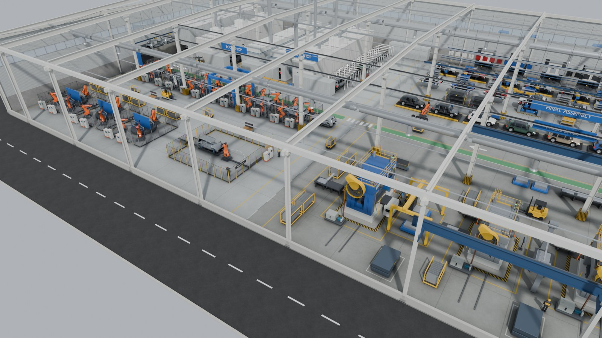
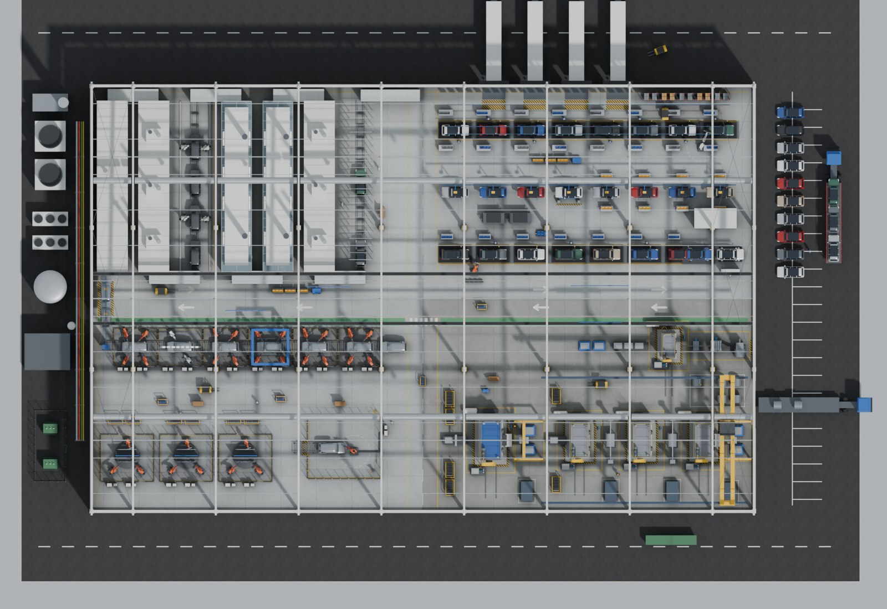
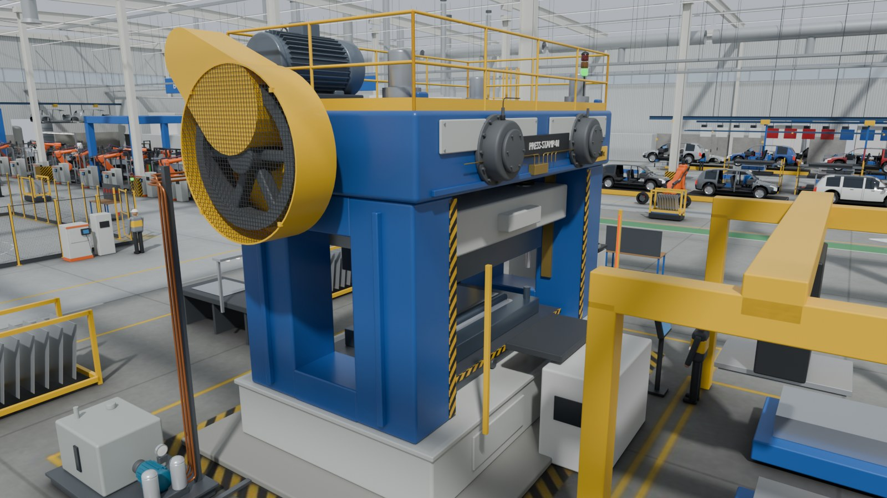
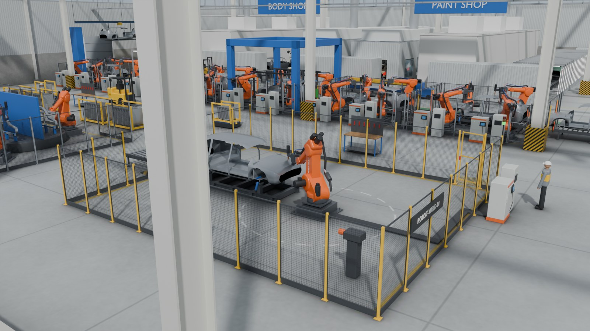
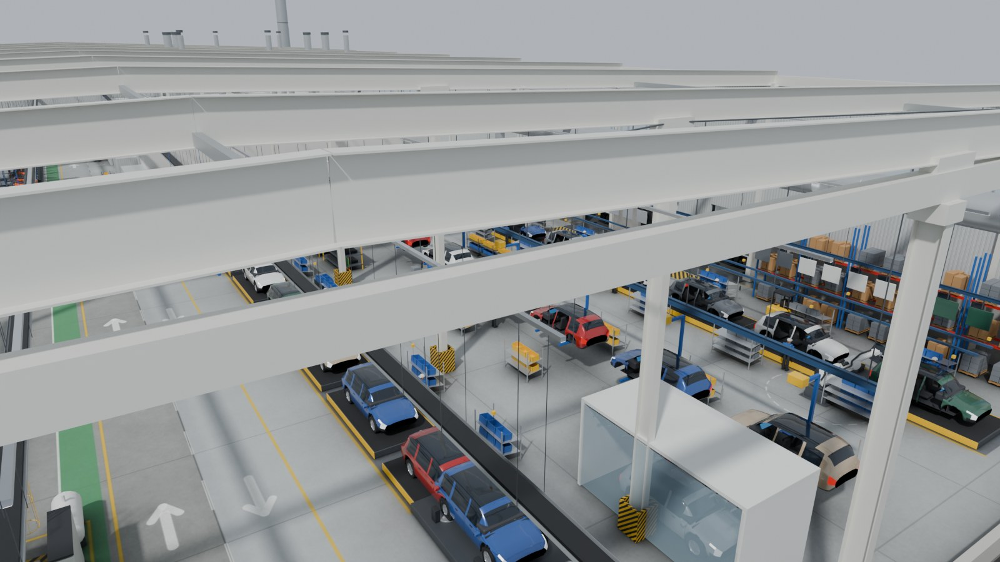
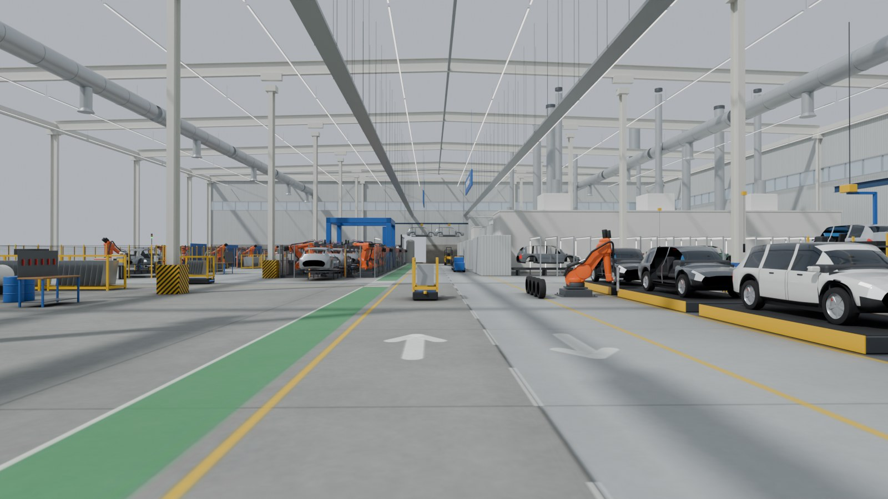

# Car factory floor plan (`car_factory_updated.glb`)

The updated twin is a complete car plant at true scale: press shop, body shop, paint shop, final assembly, end-of-line testing, logistics yards and utilities, with the two instrumented machines in the front row where the viewer opens. Everything is generated by [`blender/build_car_factory.py`](../blender/build_car_factory.py); this page records the layout it builds and why.

## Units and axes

- 1 Blender unit = 1 metre. All coordinates below are **Blender** coordinates: +X east, +Y north, +Z up, origin at the centre of the hall floor.
- The `.glb` is Y-up, as glTF requires. A Blender point `(x, y, z)` is `(x, z, -y)` in three.js.
- Headings are degrees about Z, measured from +X (east). A machine at heading 90 has its own front (local -Y) facing east.

## Site

| Item | Value | Why |
|---|---|---|
| Hall | 112 m x 72 m, X -56 to 56, Y -36 to 36 | Four 56 m x 36 m departments in a 2 x 2 block: a real plant's shops, each shortened to a representative length so the whole plant fits one viewer session |
| Column grid | X lines -56, -49, -35, -21, -7, 7, 21, 35, 49, 56; Y lines -36, -12, 12, 36 | 14 m x 24 m bays, typical for a steel portal-frame hall; no column stands in the two main aisles |
| Eaves | 13.0 m, rafters 0.9 m deep, ridge 1.1 m higher | Clears a 20 t crane over the presses (rail 9.6 m) and the paint-shop ducts |
| Walls | North and west walls full height (precast plinth to 3 m, cladding, ribbon windows at 8.4 to 9.8 m, four dock doors); south and east cut away to a 0.9 m upstand | An architectural cut-away: the viewer looks in from the south-east |
| Roof | Portal frames only, no sheeting or purlins | A raised camera sees down into the hall between slim rafters |
| Main aisles | East-west, 6 m wide at Y 0; north-south, 5 m wide at X 0 | Forklift and AGV traffic, two-way, with a 1.3 m green pedestrian walkway south of the east-west aisle |
| Yards | Asphalt ring: 12 m south and west, 18 m north (truck docks) and east (dispatch) | Inbound trucks, coil delivery, finished cars, car transporter |

## Departments and flow

Material flows anticlockwise, coil dock to dispatch:

| Department | Area (X, Y) | What is in it |
|---|---|---|
| Press shop (south-east) | 0 to 56, -36 to 0 | **PRESS-STAMP-01** transfer line at the west end; three-press tandem line (1,600 t, 10.5 m pitch) with crossbar feeders and its own destacker; coil line at Y -8 (decoiler, straightener, servo feed, blanking press, blank stacks); coil store; die storage; stillages; 20 t overhead crane over the tandem line |
| Body shop (south-west) | -56 to 0, -36 to 0 | **ROBOT-WELD-01** cell at the press-shop end; main line at Y -8.2, six stations at 7.6 m pitch (respot, respot, open-gate framing, respot, geometry inspection, closures); three side-frame sub-assembly cells with rotary tables; panel racks; overhead monorail carrying bodies north across the aisle into paint |
| Paint shop (north-west) | -56 to 0, 0 to 36 | Seven 5 m wide, 29 m long north-south tunnels between the column lines: pretreatment and e-coat dip (bodies tilting into the bath), e-coat oven, sealer deck, primer booth, base and clear coat booth (glass walls, white painting robots), topcoat oven, inspection light tunnel; exhaust stacks to 16 m |
| Final assembly (north-east) | 0 to 56, 0 to 36 | Trim line at Y 28.5 (bodies on skillets, doors off, glazing robot), chassis line at Y 18 (bodies on overhead C-hangers, EV battery marriage station), final line at Y 7.5 (wheel robot, doors back on), end-of-line alignment rig, roller dyno and water test; overhead door conveyor; parts supermarket against the north wall |
| Dispatch and logistics | outside, north and east | Four inbound trucks at the north docks, coil flatbed at the press-shop dock, eleven finished cars and a loaded car transporter in the east yard |
| Utilities | outside, west | Cooling towers, chillers, water tank, compressor house with air receiver, fenced transformer compound, paint-shop oxidiser with a 24 m stack, pipe bridge into the hall |

Takt spacing in assembly is 6.4 m per station, the usual pitch for a mid-size car; the cars themselves are 4.60 m x 1.86 m x 1.62 m crossover EVs on a 2.82 m wheelbase, shown at every stage from bare body-in-white to finished car.

## The two instrumented machines

| | PRESS-STAMP-01 | ROBOT-WELD-01 |
|---|---|---|
| Position | (11.5, -24.0, 0.0) | base (-11.6, -25.85, 0.35) on a 0.35 m pedestal |
| Heading | 90: die area faces east, towards its destacker | 180: faces west, into the body on its fixture |
| Scale | 1.0, true size | 1.0, true size |
| Size | Bed 6.8 m x 4.0 m; foundation 8.2 m x 5.4 m; crown top 5.5 m; main motor top 6.6 m | 210 kg class, 2.70 m reach to the wrist, 3.5 m to the electrode tips |
| Real-world reference | A 2,500 t servo transfer press stands 6 to 7 m above the floor with a bolster around 4.6 m x 2.6 m | A KR 210 R2700-class arm: A2 0.675 m above the base, lower arm 1.15 m, forearm 1.22 m |

**Why the press sits where it does.** It is the draw press of its own transfer line at the west end of the press shop. Its finished panels go straight across the north-south aisle into the body shop, which is the shortest real flow, and it places both instrumented machines in one camera view.

**Robot cell and safety distances.**
- The fence is 12.5 m x 10.5 m (X -19.5 to -7.0, Y -30.5 to -20.0), 2.2 m high welded mesh with a 0.15 m kick plate (ISO 14120 style).
- The robot base is 4.6 m from the nearest fence. Its electrode tips reach 3.5 m, so the guard sits at least 1.1 m beyond the furthest point the tool can touch.
- The body arrives on a roller conveyor through a muted light-curtain opening in the west fence. There is an interlocked gate in the north fence, with the operator panel and a stack light beside it.
- The robot controller and weld timer stand outside the east fence.

**Spacing between the two machines.**
- The press foundation ends at X 8.8 and the robot fence at X -7.0, so 15.8 m of floor separates them, including the 5 m aisle.
- That is about four times the 3 to 4 m minimum exclusion zone in the brief.
- The press also has its own hazard-striped foundation edge and a keep-out line 1.4 m further out.

## Mesh names for binding

The viewer binds sensors by the exact mesh name, so every mesh is upper case `A-Z 0-9 _`, unique, and single-material.

Why those rules:
- three.js strips `[ ] . : /` from node names.
- An instanced multi-material mesh would yield duplicate child names. The build prevents both, and the Khronos validator reports 0 errors and 0 warnings.

| Channel | Sensor ID | Mesh to bind | What it is |
|---|---|---|---|
| Main motor current | `PRESS-STAMP-01.MAIN_MOTOR_CURRENT` | `PRESS_MAIN_MOTOR` | 250 kW main drive motor on the crown |
| Lube oil pressure | `PRESS-STAMP-01.LUBE_OIL_PRESSURE` | `PRESS_LUBE_FILTER` | Duplex lube filter bank on the lubrication skid |
| Bearing vibration RMS | `PRESS-STAMP-01.BEARING_VIBRATION_RMS` | `PRESS_MAIN_BEARING` | Drive-end main bearing housing (its accelerometer is `PRESS_MAIN_BEARING_SENSOR`) |
| Axis 4 servo torque | `ROBOT-WELD-01.AXIS_4_SERVO_TORQUE` | `ROBOT_A4_SERVO_MOTOR` | Wrist-roll servo motor at the back of the arm |
| Tool centre point deviation | `ROBOT-WELD-01.TOOL_CENTER_POINT_DEVIATION` | `ROBOT_WELD_GUN_TIP` | Electrode caps: the tool centre point |
| Weld gun temperature | `ROBOT-WELD-01.WELD_GUN_TEMP` | `ROBOT_WELD_GUN` | Servo spot-welding gun with its transformer |

Every bindable part has a neutral colour (slate, silver, light grey, graphite), so the viewer's selection, warning, alarm and agent tints all read clearly on it.

The six binding meshes belong to a larger set of 69 labelled, registered meshes. The press has 37 of them, among them:
- `PRESS_CROWN`, `PRESS_SLIDE`, `PRESS_BED`, `PRESS_BOLSTER`, `PRESS_UPRIGHT_LEFT`, `PRESS_UPRIGHT_RIGHT`
- `PRESS_DIE_UPPER`, `PRESS_DIE_LOWER`, `PRESS_PANEL`
- `PRESS_FLYWHEEL`, `PRESS_FLYWHEEL_GUARD`, `PRESS_CLUTCH_BRAKE`
- `PRESS_LUBE_UNIT`, `PRESS_LUBE_PUMP`, `PRESS_LUBE_GAUGE`
- `PRESS_ANDON`, `PRESS_HMI`, `PRESS_CONTROL_CABINET`

The robot cell has 32, among them:
- the arm: `ROBOT_BASE`, `ROBOT_A1_COLUMN`, `ROBOT_A2_LOWER_ARM`, `ROBOT_A3_ARM`, `ROBOT_A4_FOREARM`, `ROBOT_A5_WRIST`, `ROBOT_A6_FLANGE`, `ROBOT_DRESS_PACK`
- the cell: `ROBOT_CONTROLLER`, `ROBOT_FIXTURE`, `ROBOT_CELL_FENCE_MESH`, `ROBOT_CELL_BEACON`

The body-in-white on the fixture is `ROBOT_BIW`.

Each named mesh carries glTF extras that three.js exposes as `object.userData`:
- `cdo_label`, a readable name
- `cdo_zone`
- `cdo_machine`
- `cdo_role`
- `cdo_tags`, for example `lube_filter` or `main_bearing_housing`, the component tags the agent's signature library uses
- `cdo_suggested_channel`

The same facts are written to `car_factory_updated.registry.json` beside the `.glb`, for the agent's `find_meshes` tool.

Background machinery is merged by material and named by area. Examples:
- `BODY_LINE_RESPOT_18_ROBOT_ORANGE`
- `ASM_TRIM_CAR_3_PAINT`
- `STRUCT_C0601_STRUCT_WHITE`

## Views carried in the model

Four pairs of empty nodes, `VIEW_<NAME>` and `VIEW_<NAME>_TARGET`, mark camera presets:

| Preset | Eye | Looks at |
|---|---|---|
| `HOME` | (27, -64, 34) | (-0.5, -22, 0): both instrumented machines |
| `PRESS_STAMP_01` | (18.5, -40.5, 8.5) | (11.5, -24, 3) |
| `ROBOT_WELD_01` | (-2.5, -40, 7) | (-13, -25.3, 1.4) |
| `PLANT` | (80, -95, 70) | (0, 0, 0) |

The twin viewer opens on `VIEW_HOME` when the model has it (`findNamedView` in `client/src/lib/three-helpers.js`). Framing the whole site by its bounding sphere would start 375 m out, where both machines are specks. Models without the nodes keep the old framing.

## Budget

| Measure | Value |
|---|---|
| File | 24.5 MB (upload limit 50 MB); no Draco or meshopt, so nothing is fetched from a CDN |
| Rendered triangles | 1.30 million (759,000 unique; repeated machines and cars are instanced) |
| Mesh nodes | 2,062 |
| Materials, textures | 90, 9 (floors baked with ambient occlusion, tiling cladding, concrete, asphalt, wire mesh, grating, hazard stripes) |
| Load in the viewer | about 0.3 s from local disk |

