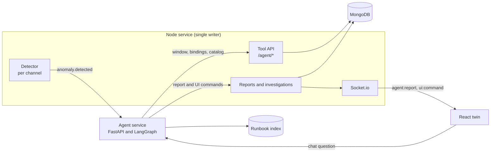
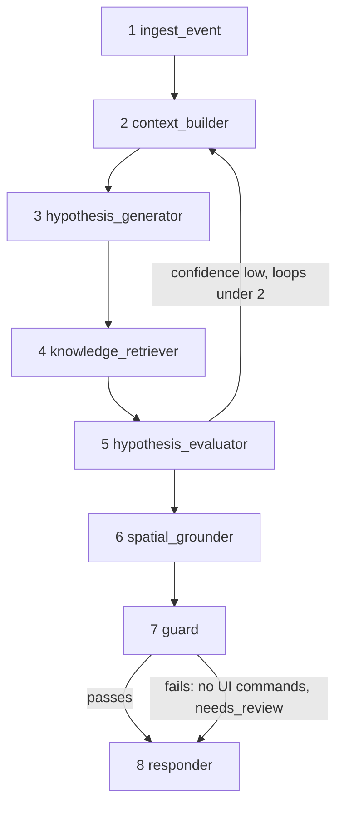
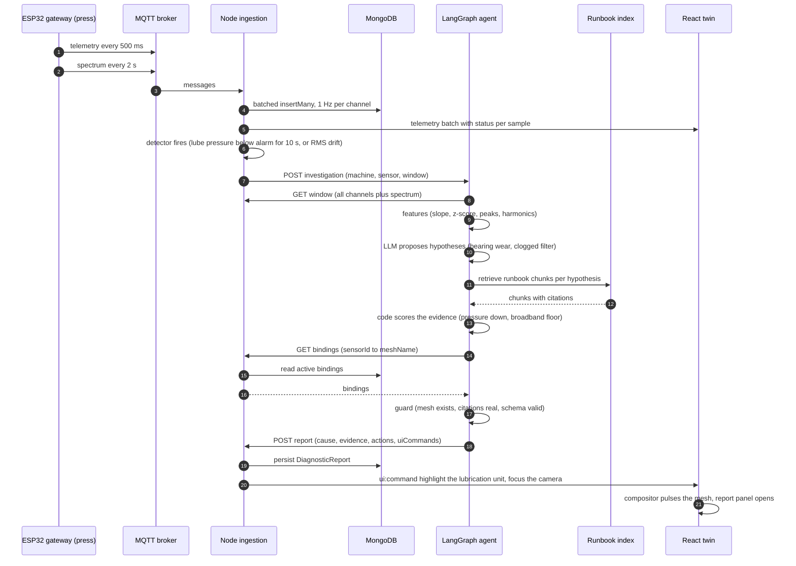

# Phase 5 blueprint: the diagnosis agent

Design only. Nothing in this document is built yet, and no Python exists in the repository. It records what the agent will be, what it will reach, and how it will be judged, so that Phase 5 starts from decisions instead of a blank page. The parts of the platform it will plug into already exist and are listed in [What exists today](#what-exists-today).

## The problem it solves

A dashboard floods operators with alarms and explains none of them. When the stamping press raises a vibration alarm, the operator still has to decide whether the cause is a worn bearing (days of downtime) or a clogged lubrication filter (a five-minute cartridge swap), and then walk to the right part of the machine.

The agent takes an anomaly, correlates every channel of that machine, retrieves the maintenance manual, tests competing hypotheses against the evidence, and then uses the **operator's own sensor bindings** to highlight the responsible component in the 3D twin, with cited reasons. The operator receives a located, explained root cause instead of another flashing alarm.

The two press faults share a symptom (high bearing vibration) and differ in evidence: lube oil pressure, and whether the spectrum shows broadband noise or a discrete harmonic family. That is what makes the diagnosis genuinely discriminative. Causally, a clogged filter starves the bearings, so ignoring it is how the expensive failure eventually happens.

## Principle

**The model is never in the hot path.** A cheap, deterministic detector inside the Node service decides when something deserves investigation. Only then does the agent run. This is also the alarm-fatigue argument: many alarms collapse into few investigations.

**The model never does arithmetic.** Slopes, z-scores, correlations, spectral peaks and harmonic ratios are computed in code. The model proposes hypotheses and writes the narrative; **confidence is computed in code**, never taken from the model's self-report.

**The agent cannot act on a machine.** It has no write tool toward devices. Its only outputs are a report and UI commands.

## Topology

Node stays the single writer: it owns bindings and the time series. The agent is a separate, stateless Python service (FastAPI plus LangGraph) in `services/agent/`, and it is a **consumer**. It reaches data only through a tool API served by Node, authenticated with a service key. Results go back to Node, which persists them and pushes them to browsers over the existing Socket.io connection. Investigations are persisted, so a backend restart does not reopen one.



The agent can also start from the chat panel (`trigger: user_query`). The operator's currently selected mesh becomes implicit context: the selected mesh name resolves to its bound sensor.

## Trigger path: the detector

`telemetry.service` runs a detector per channel. It is deliberately simple and explainable.

| Rule | Default | Catches |
|---|---|---|
| Threshold with hysteresis | Beyond the alarm limit for 10 s opens; back inside for 10 s clears | The faults a limit can see |
| Drift | Rolling z-score against the channel's own baseline above 3 for 30 s, or a sustained positive slope of the 60 s mean over 10 minutes | A fault that never reaches a limit |
| Debounce | One open investigation per machine; a 10 minute cooldown after it closes | One fault becoming one investigation |

The drift rule matters. `BEARING_WEAR` never crosses the vibration alarm limit (the RMS peaks at 3.2 mm/s against a limit of 4.0), so a pure threshold baseline misses it entirely and only drift catches it. That gap is the thesis argument for the agent.

On a trigger the detector emits `anomaly.detected`, and Node posts it to the agent:

```
POST /v1/investigations
{ investigationId, machineId, assetId, sensorId, status, windowSec }
```

## The graph

State: `investigationId, trigger, machineId, assetId, window, features, hypotheses, retrievedChunks, evidenceTable, confidence, rootCause, componentTags, resolvedMeshes, uiCommands, report, loops`.



| # | Node | Kind | Job |
|---|---|---|---|
| 1 | `ingest_event` | code | Normalise the trigger and open the trace |
| 2 | `context_builder` | tools and code | Fetch the last N minutes of **all** channels of the machine plus the spectrum through `GET /agent/window`. Compute slope, z-score, cross-channel correlation, dominant peaks, harmonic ratios and the broadband-versus-discrete shape in numpy |
| 3 | `hypothesis_generator` | LLM, structured output | Two to four candidate faults with expected signatures |
| 4 | `knowledge_retriever` | retrieval | Keyword plus embedding search over runbooks filtered by machine model and component. Returns chunks with document, section and page. Under 100 chunks, BM25 plus in-memory embeddings is enough; the embedding provider is an explicit dependency to choose |
| 5 | `hypothesis_evaluator` | code first, LLM for narrative | Test each signature against the computed features. **Confidence is computed in code** from signature matches. Below the threshold it loops to fetch a longer window or ask the operator, at most twice |
| 6 | `spatial_grounder` | code | Resolve component tags to meshes (below) |
| 7 | `guard` | code | Validate; see [The guard](#the-guard) |
| 8 | `responder` | LLM | The operator text: observation, diagnosis, evidence, recommended action, confidence and citations, plus `uiCommands` |

### Signatures

Each hypothesis is a short list of tests with weights. The evaluator scores the evidence against all of them and reports the margin over the runner-up as well as the score.

| Hypothesis | Evidence expected |
|---|---|
| Bearing wear | Vibration RMS up. A discrete harmonic family at non-integer multiples of the shaft frequency (about 3.55, 7.1, 10.65, 14.2, 17.75 times) with sidebands. Lube pressure normal. Motor current up slightly |
| Clogged lubrication filter | Lube pressure down. A broadband noise floor above 300 Hz with no discrete family. Vibration RMS up. Motor current up slightly |
| Gearbox wear (robot) | Axis 4 torque mean up, a sixth-harmonic ripple, TCP deviation up |

Because the shaft frequency is declared in the device's birth message (`fundamentalHz`), the harmonic tests need no machine-specific constant in the agent.

## Spatial grounding

This is the novel part. The model outputs **component tags**, for example `lube_filter` or `main_bearing_housing`, and never mesh names. Real names in an asset pack are long and machine-generated, and a model hallucinates them. The `spatial_grounder` then walks:

```
component tag -> evidence channel -> sensorId -> SensorBinding -> meshName
```

through `GET /agent/bindings?assetId`. A small versioned table maps each tag to the channel that evidences it:

| Component tag | Evidence channel |
|---|---|
| `lube_filter`, `lubrication_unit` | `PRESS-STAMP-01.LUBE_OIL_PRESSURE` |
| `main_bearing_housing` | `PRESS-STAMP-01.BEARING_VIBRATION_RMS` |
| `main_drive_motor` | `PRESS-STAMP-01.MAIN_MOTOR_CURRENT` |
| `robot_forearm_axis_4` | `ROBOT-WELD-01.AXIS_4_SERVO_TORQUE` |
| `tool_flange` | `ROBOT-WELD-01.TOOL_CENTER_POINT_DEVIATION` |
| `weld_gun` | `ROBOT-WELD-01.WELD_GUN_TEMP` |

The operator's own bindings are the ontology bridge between a physical part and a signal. If the causal component has no binding, the report says so (`needs_binding: LUBE_OIL_PRESSURE`) and invites the operator to bind it, instead of inventing a highlight.

## The guard

Pure code, no model:

1. The report matches its schema (Pydantic).
2. Every mesh name exists in the asset's scene payload.
3. Every citation comes from a chunk that was actually retrieved.
4. Maintenance wording carries an OEM-procedure and lock-out caveat.

If a check fails, the flow continues to the responder with `uiCommands = []` and `needs_review` set. A degraded answer is better than no answer, and never a wrong highlight.

## Tool API (served by Node)

Authenticated with a service key. None of these responses include `diag.sim` or any `ack.detail`: the ground truth stays out of the agent's reach.

| Endpoint | Returns |
|---|---|
| `GET /agent/window?machineId&from&to&bucketSec` | Every channel bucketed, plus spectrum frames |
| `GET /agent/bindings?assetId` | `sensorId` to `{meshName, displayName, meshNodeId}` |
| `GET /agent/catalog?machineId` | Channels with units and limits, and the spectrum layout |
| `POST /agent/reports` | Persists a `DiagnosticReport`, emits `agent:report` and `ui:command` on Socket.io |

The `ui:command` payload goes straight into the highlight compositor with source `agent` and into the camera:

```json
{
  "investigationId": "inv-2f9c",
  "commands": [
    { "type": "highlight", "meshName": "...", "tone": "alarm", "pulse": true, "label": "Lubrication unit" },
    { "type": "camera_focus", "meshName": "..." }
  ]
}
```

## Sequence



## Knowledge base

Original maintenance runbooks written to match the simulator's physics, so the retrieval has something truthful to cite. Original OEM PDFs stay out of git for licensing reasons; the pipeline accepts them unchanged in production.

Two stubs exist in [`docs/runbooks/`](runbooks/):

- the press lubrication circuit and filter, including that the pressure transducer sits **downstream** of the filter, so a clog lowers the reading;
- the press main motor bearings and vibration diagnostics.

Planned: robot gearbox wear and TCP calibration. The full corpus belongs to Phase 5.

## Evaluation

The simulator's scenario label (`diag.sim`) is automatic ground truth, read only by the evaluation harness. The harness runs N trials per scenario (normal, clogged filter, bearing wear, gearbox wear), using the simulator's seed and `--speed` options to run them quickly and repeatably, and reports:

| Measure | What it shows |
|---|---|
| Root-cause accuracy as a confusion matrix | Whether it tells the two press faults apart |
| Detection lead time against a threshold-alarm baseline | The baseline does not diagnose, so the comparison is detection and diagnosis accuracy, not time to diagnosis. For bearing wear the baseline never fires |
| Alerts collapsed into investigations | The alarm-fatigue reduction |
| Citation faithfulness | Whether every cited chunk supports the claim |
| Grounding accuracy | Whether the highlighted component is the one the scenario truth names |
| `needs_binding` rate | How often a missing binding blocks a highlight |

Ablations: without retrieval, and with single-channel context instead of cross-channel context. Reproducibility comes from repeated trials, not from sampling parameters.

## Model notes

The chat interface is model-agnostic. The reference configuration uses `claude-sonnet-5-5` for diagnosis and `claude-haiku-4-5` for routing and summaries, both swappable by environment variable. Use the API's native schema-constrained structured output rather than a forced tool choice. Newer models restrict some sampling and tool-choice parameters, so a framework default that forces a tool could be rejected: check the current parameter constraints for the chosen model against the API reference when Phase 5 is built. Checkpoint every investigation with a LangGraph checkpointer (SQLite in development) for resumability and a full audit trace.

## What exists today

| Piece | Where | Status |
|---|---|---|
| Sensor to mesh index, refreshed on every binding change | `server/src/services/bindingIndex.service.js` | Built |
| Bucketed history and the latest spectrum | `GET /telemetry/history`, `GET /telemetry/spectrum/latest` | Built |
| Channel catalog, limits and spectrum layout per device | `Device` model, `GET /devices` | Built |
| Ground truth kept server-side, outside every general stream | `diag.sim`, `GET /devices/:id/sim` | Built |
| Highlight compositor with an `agent` priority above alarm | `client/src/features/twin-viewer/scene/highlightCompositor.js` | Built, unused until Phase 5 |
| Camera focus on a named mesh | `requestCameraCommand({ action: 'focus', meshName })` | Built |
| Fault injection without a cable | `POST /devices/:machineId/commands` | Built |
| Simulator with seeded, accelerated, repeatable faults | `server/scripts/simulate-devices.mjs` | Built |

To build: the detector, the `/agent/*` routes and service key, the `Investigation` and `DiagnosticReport` collections, the agent service, a `ui:command` handler in `RealtimeBridge`, the report panel, the runbook corpus and the evaluation harness.
